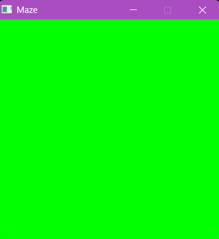
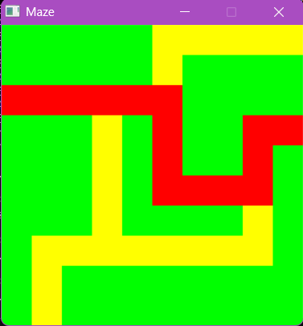

# 🗺️ Interactive Recursive Maze Solver
An interactive maze visualizer built with SDL2 to explore recursive pathfinding algorithms, grid-based data structures, and event-driven programming in C.

## 📖 Overview
This project was built to explore how recursion can be visualised in an interactive environment. Rather than solving a predefined maze, users can design their own paths and watch a recursive depth-first search discover a route from one side of the grid to the other. 
The project combines graphical rendering, recursion, pointer-based graph traversal, and event-driven programming into a simple interactive application, making it an engaging way to better understand how recursive search algorithms operate behind the scenes.

## 🌟 Why I Built This
I wanted to explore SDL2 beyond basic graphics by creating an interactive application that visualises recursive pathfinding in real time. The project challenged me to combine event-driven programming, graph traversal, and graphical rendering into a single application.

## ✨ Features
- 🖱️ Draw custom maze paths interactively using mouse input
- 🟨 Real-time grid editing with immediate visual feedback
- 🌳 Recursive **Depth-First Search (DFS)** pathfinding
- 🔴 Automatically highlights the discovered solution path
- ⚡ Event-driven rendering powered by SDL2
- 🧩 Grid represented as interconnected cells using neighbour pointers
- 🎨 Simple colour-coded visualisation for maze construction and search results

## 📸 Screenshots
<p align="center">
  
  
</p>

<p align="center">
  
</p>

<p align="center">
  <em>The recursive search highlights the discovered path in red.</em>
</p>

## 🛠️ Tech Stack
- Language: C
- Graphics Library: SDL2
- IDE: VS Code

## ⚙️ Quick Start
### Prerequisites
Before running thr project, ensure the following are installed:
- C Compiler (gcc or MinGW)
- SDL2 Development Library
- VS Code (recommended)
### Clone Repository
Change 'yourusername' with your GitHub username to run the command.
```bash
git clone https://github.com/yourusername/recursive-maze-solver.git
cd recursive-maze-search
```
### Install SDL2
Download and install SDL2 Development Library appropriate for your operating system.
### Build the Project
Compile the project using your preferred compiler or build configuration.
```bash
gcc mazealg.c -o maze.exe $(pkg-config --cflags --libs sdl2)
```
### Run the executable
```bash
./maze.exe
```

For detailed setup instructions, see [INSTALL.md](https://github.com/eeche-van/recursive-maze-search/blob/main/INSTALL.md).
## 🎮 Controls / Indicators
- 🖱 Left Click - Creates maze path
- 🖱 Right Click - Starts the recursive search
- 🟨 Yellow - Walkable path
- 🟥 Red - Solution path

## 📚 Challenges
One challenge was preventing the recursive algorithm from revisiting previously explored cells while still preserving the final solution path. This required careful state management using neighbour references and visited flags.

## 🚀 Future Improvements
- Animate the recursive search step-by-step
- Compare Depth First Search and Breadth First Search
- Implement A* pathfinding
- Random maze generation
- Adjustable maze sizes
- Search performance statistics
